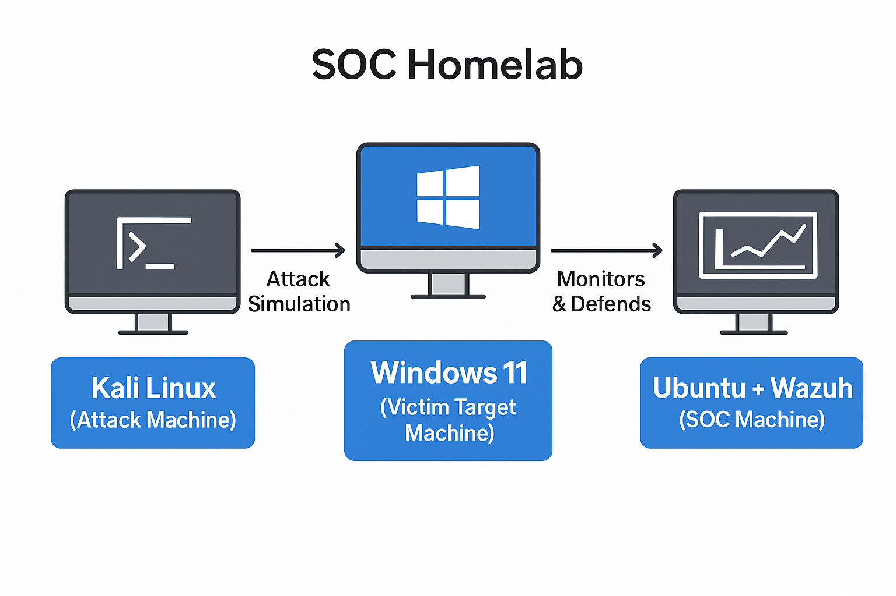

# SOC Analyst Homelab — Wazuh SIEM with Windows Agent

A fully functional mini Security Operations Center (SOC) built with free tools to practice real-world endpoint monitoring, log collection, and threat detection using **Wazuh** (open-source SIEM + XDR).

### Project Goal
Monitor a Windows 11 endpoint, collect logs in real time, and detect suspicious activity using Wazuh.

### Lab Architecture

| Machine         | Role                              | OS            |
|-----------------|-----------------------------------|---------------|
| Ubuntu Server   | Wazuh Manager + Dashboard        | Ubuntu 22.04  |
| Windows 11      | Victim / Monitored Endpoint       | Windows 11    |
| Kali Linux      | Attack simulation machine         | Kali Linux    |

### Tools Used
- Wazuh (all-in-one deployment)
- VirtualBox
- Kali Linux + Windows 11 + Ubuntu Server

## Steps Implemented

### 1. Installed Wazuh on Ubuntu Server
  

- Deployed Wazuh Manager + Dashboard on Ubuntu VM  
- Verified all services running and dashboard accessible

### 2. Configured Windows 11 as Endpoint
  

- Downloaded and installed official Wazuh Windows agent  
- Enrolled agent using manager IP and enrollment key  
- Started wazuh-agent service successfully

### 3. Validated Wazuh Agent Connectivity

- Agent appeared as **Active** in Wazuh dashboard  
- Real-time logs flowing from Windows 11 → Wazuh server  
- Full end-to-end SOC workflow validated: **Attack → Logging → Detection → Monitoring**

## Results
- Wazuh successfully detected activities on the Windows 11 endpoint  
- Agent stayed connected and continuously forwarded logs  
- Demonstrated complete SOC monitoring pipeline

## Skills & Knowledge Gained (Perfect for SOC Analyst roles)
- Hands-on SIEM experience (Wazuh deployment & management)  
- Windows endpoint agent installation & enrollment  
- Log collection, parsing, and real-time monitoring  
- Attack simulation → detection workflow  
- Building a realistic Blue Team homelab from scratch

## Next Steps (Planned)
- Add Linux endpoint agents  
- Integrate Sysmon + custom rules  
- Add TheHive or Shuffle for incident response  
- Active Directory + Velociraptor integration

---
**Built 100% with free/open-source tools** • VirtualBox • Wazuh • Kali • Windows 11

**Original PDF documentation**: [home lab setup.pdf](lab%20setup.pdf)

---
**GitHub Topics (add these so recruiters find you):**
`wazuh` `siem` `soc-analyst` `homelab` `cybersecurity` `blue-team` `endpoint-security` `threat-detection` `windows-agent` `xdr`

---
**This project is portfolio-ready — add the link to your resume & LinkedIn!**
